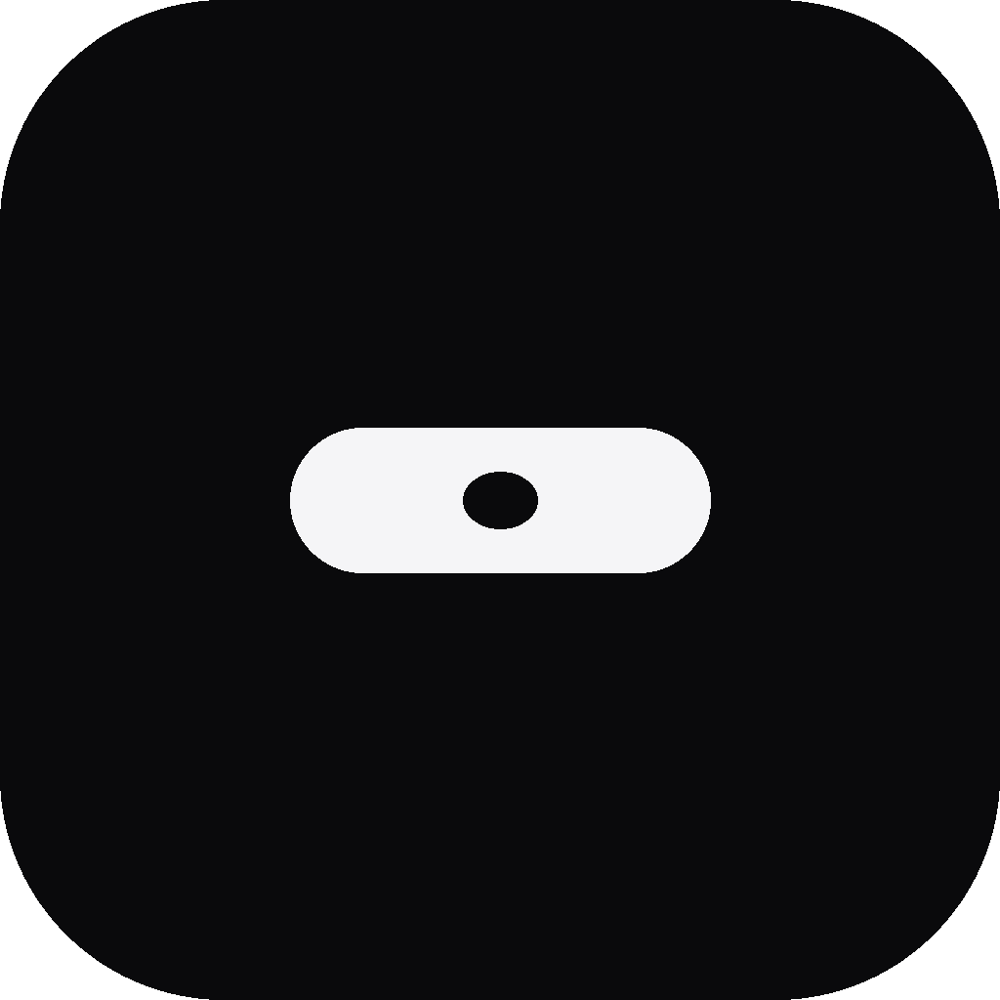
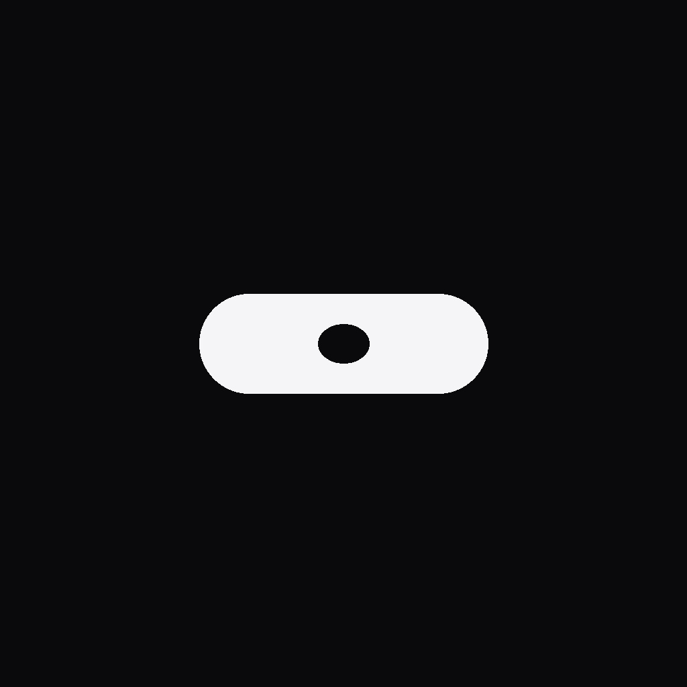

<p align="center">
  
</p>

<h1 align="center">Aura</h1>

<p align="center">
  <strong>A premium macOS Dynamic Island for focus, music, and your day.</strong>
</p>

<p align="center">
  Live media · Calendar · Menu bar command center · Floating widgets
</p>

<p align="center">
  
  
  
  
</p>

---

Aura turns the Mac notch into a calm, always-available surface — music controls, a compact calendar with event indicators, and a menu bar command center for Pomodoro, deep work, stopwatch, and todos. Floating widgets stay pinned when you need them.

Built for macOS Sonoma and later. No Xcode project required — Swift Package Manager and a single run script.

<p align="center">
  
</p>

## Highlights

| | |
|---|---|
| **Dynamic Island** | Hover to expand. Home splits media (~60%) and a 4-day calendar strip (~40%) with event dots. |
| **Calendar tab** | Scroll the current week, pick a day, see events and reminders at a glance. |
| **Live music** | Spotify / Apple Music artwork, controls, and playback-aware live activity. |
| **Command Center** | Menu bar popover for Pomodoro, Deep Work, Stopwatch, Todos, and Settings. |
| **Floating widgets** | Resizable, pinnable panels with glass styling. |
| **Focus mode** | Soft overlay when a focus session starts. |

## Requirements

- macOS **14.0** (Sonoma) or later  
- Apple Silicon or Intel Mac with a notch (non-notch displays use a floating island)  
- [Swift toolchain](https://swift.org/download/) / Xcode Command Line Tools  
- Calendar & Reminders access (optional, for the calendar module)  
- Automation access for Spotify / Music (optional, for playback control)

## Quick start

```bash
git clone https://github.com/Atharav001/Aura-mac-app.git
cd Aura-mac-app
chmod +x run.sh
./run.sh
```

`run.sh` builds the package, assembles a temporary `.app` under `/tmp/Aura.app`, codesigns with the project entitlements, and launches Aura.

### Build only

```bash
swift build
```

The debug binary is written to `.build/debug/Aura`. Prefer `./run.sh` for day-to-day use so entitlements and bundled logos are applied.

## Permissions

Grant these when prompted (or in **System Settings → Privacy & Security**):

| Permission | Why |
|---|---|
| **Calendar** | Events on the home strip and Calendar tab |
| **Reminders** | Tasks alongside calendar events |
| **Automation → Spotify / Music** | Track metadata and playback control |
| **Notifications** | Pomodoro / focus completion alerts |

## What’s inside

```text
Aura-mac-app/
├── Aura/
│   ├── AuraApp.swift              # App entry
│   ├── BoringNotch/               # Dynamic Island (vendored BN stack + host)
│   ├── Features/
│   │   ├── MenuBar/               # Status item + Command Center
│   │   ├── Settings/              # Aura settings window
│   │   ├── Widgets/               # Pomodoro, Todo, Stopwatch, …
│   │   └── FocusRitual/           # Focus overlay
│   ├── Core/WindowManagement/     # Floating panels
│   └── Resources/Logos/           # Dock, menu bar, and marketing marks
├── docs/branding/                 # README / GitHub assets
├── Package.swift
└── run.sh
```

## Configuration

Open **Settings** from the menu bar Command Center or the gear in the open island.

Useful toggles:

- **Duo mode (media + calendar)** — home layout with music and the 4-day strip  
- **Show in Dock** — reveal the branded dock icon while windows are open  
- **Show Menu Bar icon** — island status item  
- Calendar filters (hide all-day events, title truncation)

## Attribution

The Dynamic Island experience is built on the open-source [Boring Notch](https://github.com/TheBoredTeam/boring.notch) UI stack (`ContentView` and related components), hosted in-process via `BoringNotchHost`.

Boring Notch is licensed under **GPL-3.0**. See `Aura/BoringNotch/NOTICE.md` for what is vendored, kept Aura-native, and intentionally shimmed (Sparkle, SkyLight lock-screen window, Lottie, XPC helper, etc.).

Aura-specific layers — menu bar Command Center, floating widgets, focus ritual, and Aura Settings — live outside that stack.

## Roadmap ideas

- Polished release `.app` / notarized builds  
- Deeper Settings for calendar source selection  
- Optional Mirror / HUD refinements  
- Website + download page using the same brand mark  

## Contributing

Issues and pull requests are welcome. Keep changes focused, match the existing SwiftUI + AppKit style, and test with `./run.sh` on a notched Mac when possible.

## License

This repository incorporates GPL-3.0–licensed Boring Notch sources. Treat distribution of the combined application accordingly (see Boring Notch’s license and `Aura/BoringNotch/NOTICE.md`). Aura-original code is provided for use with this project; clarify licensing with the maintainer before commercial redistribution.

---

<p align="center">
  
  <br />
  <sub>Aura — focus at the top of your screen.</sub>
</p>
